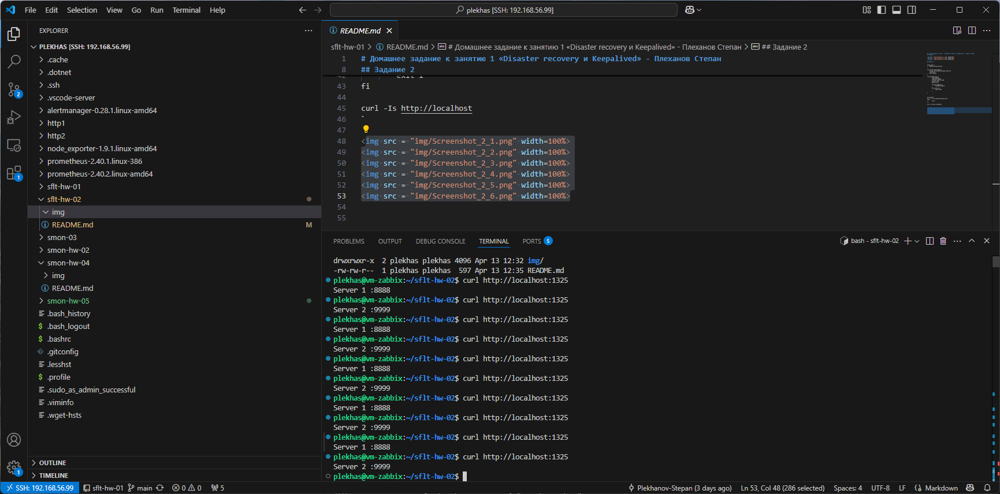
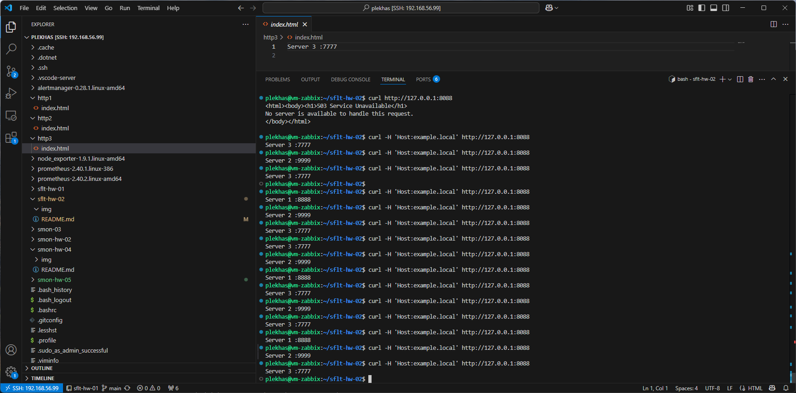

# Домашнее задание к занятию 1 «Disaster recovery и Keepalived» - Плеханов Степан
## Задание 1

Конец файла /etc/haproxy/haproxy.cfg
````bash

listen stats  # веб-страница со статистикой
        bind                    :888
        mode                    http
        stats                   enable
        stats uri               /stats
        stats refresh           5s
        stats realm             Haproxy\ Statistics

listen web_tcp

        bind :1325

        server s1 127.0.0.1:8888 check inter 3s
        server s2 127.0.0.1:9999 check inter 3s
````


## Задание 2

Конец файла /etc/haproxy/haproxy.cfg
````bash
listen stats  # веб-страница со статистикой
        bind                    :888
        mode                    http
        stats                   enable
        stats uri               /stats
        stats refresh           5s
        stats realm             Haproxy\ Statistics

frontend example  # секция фронтенд
        mode http
        bind :8088
        acl ACL_example.local hdr(host) -i example.local
        use_backend web_servers if ACL_example.local

backend web_servers    # секция бэкенд
        mode http
        balance roundrobin
        option httpchk
        http-check send meth GET uri /index.html
        server s1 127.0.0.1:8888 check weight 2
        server s2 127.0.0.1:9999 check weight 3
        server s3 127.0.0.1:7777 check weight 4
````


